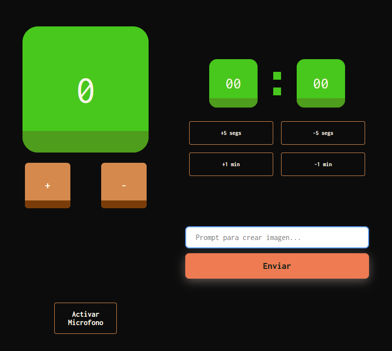

# 🧩 React-Grid

Una aplicación web desarrollada con React que combina múltiples funciones en una interfaz visual tipo panel de control, incluyendo temporizadores, control por voz, y entrada de texto para generar prompts de imagen.

## 📸 Vista previa

## ✨ Funcionalidades principales

- ⏱️ **Temporizador dual**: Control independiente de minutos y segundos, con botones para aumentar o disminuir el tiempo.
- ➕➖ **Contador interactivo**: Incrementa o decrementa un valor con botones "+" y "-".
- 🎙️ **Control por voz**: Botón para activar el micrófono y usar comandos por voz (requiere permisos del navegador), integración con GIPHY API para mostrar contenido dinámico.
- 📝 **Generador de prompts**: Caja de texto para ingresar un prompt y botón para enviarlo, obteniendo mediante llamado a la API de HUGGING FACE, una imagen aproximada con la descripción dada.

## 🚀 Cómo ejecutar el proyecto

1. `git clone https://github.com/Coto-Dev-JMC/React-Grid && cd React-Grid`.
2. `npm install`.
3. `ir a HUGGING FACE y GIPHY DEVELOPERS, crear una cuenta, verificarla y consigue tu api TOKEN `.
4. `Crear un archivo .env y poner ahi los TOKENS correspondientes para luego utilizarlos en la app`
5. `npm run dev`.
6. Abrir `http://localhost:5173` en el navegador.
